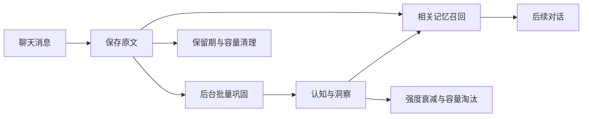

<div align="center">


# Memoir · 让对话留下记忆

为 AstrBot 提供长期记忆：保存对话、提炼认知，在下一次交流时想起来。

[](https://github.com/lxfight/astrbot_plugin_memoir/actions/workflows/ci.yml)
[](https://github.com/AstrBotDevs/AstrBot)
[](LICENSE)

**私聊与群聊 · 图片与语音 · 分层召回 · 可视化管理**

[快速上手](#快速上手) · [界面预览](#界面预览) · [多媒体](#多媒体消息) · [配置](#配置指南) · [更新日志](CHANGELOG.md)

</div>

---

## 能做什么

Memoir 将聊天原文保存到 SQLite，再由后台模型周期性提炼长期认知与洞察。后续对话会按相关性召回记忆；原文清理、记忆衰减和容量限制共同控制数据规模。

| 能力 | 实际行为 |
| :--- | :--- |
| **记住对话** | 私聊记录用户与助手的完整轮次；群聊被动捕获消息并补记机器人回复，不额外唤醒机器人。 |
| **理解多媒体** | 所选模型支持时，将图片内容、图片文字和语音转写为可检索的描述。 |
| **提炼与召回** | 后台批量整理事实与洞察，通过常驻、线索、近因三层召回，统一限制提示词字符数。 |
| **区分人物** | 私聊记忆按用户隔离；群聊共享记忆池，个人事实按稳定发送者 ID 去重。 |
| **查看与管理** | 查看来源原文、调整会话策略、删除记忆、查看失败原因并重试。 |
| **按需桥接** | 经用户授权后，将群聊中的自我陈述送入该用户的私聊记忆流程，默认关闭。 |

检索使用 SQLite 的精确匹配与模糊匹配，不需要向量数据库或 Embedding 服务。文本捕获不调用模型；周期巩固与受支持的媒体解析会产生模型调用费用。

## 快速上手

> [!IMPORTANT]
> **安装后私聊和群聊记忆默认开启。**群聊会被动记录机器人收到的消息，即使没有 @机器人或触发回复也可能记录；指令、忽略名单和关键词过滤仍生效。原文保存在本地，后台巩固会将本批原文与相关记忆发送给所选模型处理；启用对应模型能力后，媒体也会发送给模型解析。
>
> 不需要群聊记忆时，请在插件配置中关闭「启用群聊记忆」；也可在「记忆管理 → 会话配置」按群关闭。**关闭开关不会清空已有数据**，需要删除时请使用「清空会话」。全局关闭优先于会话配置。

1. 在 AstrBot 插件管理中，通过以下仓库链接安装 Memoir：

   ```text
   https://github.com/lxfight/astrbot_plugin_memoir
   ```

2. 打开插件配置，确认私聊、群聊记忆开关；选择「后台小模型」，或留空以使用消息所属会话的当前对话模型。
3. 若需要图片或语音识别，在 AstrBot 对应提供商的「模型能力」中勾选模型实际支持的「图像」和/或「音频」。
4. 正常聊天后，发送 `/memoir` 查看统计，或从插件详情进入「记忆管理」页面，查看原文、记忆和处理状态。

> 原文先保存，长期记忆稍后提炼。默认每 30 分钟扫描一次：私聊积累 20 轮、群聊积累 50 条，或达到巩固时间阈值后进行抽取。刚安装时暂时没有结构化记忆属于正常情况。

本文对应 `main` 分支；已发布版本与尚未发布的变化请见 [CHANGELOG](CHANGELOG.md)。升级后重载插件，旧数据库会自动迁移。

### 模型调用与费用

| 环节 | 调用行为 |
| :--- | :--- |
| 文本保存 | 不额外调用模型。 |
| 记忆巩固 | 每批通常调用 1 次；输出格式或结构校验失败时最多重试 1 次。积压时单会话每轮扫描最多连续处理 3 批，因此单会话一轮最多可发起 6 次巩固请求。 |
| 图片与语音解析 | 每条消息中受支持的附件合并，通常额外调用 1 次描述模型；WebUI 手动重试会再次发起处理。 |
| 后续对话召回 | 检索本身不额外调用模型，但注入的记忆会增加对话模型的输入 Token，可能增加费用。 |

上述次数指插件发起的请求，不包含提供商内部可能发生的重试；实际费用以提供商计费为准。数量阈值控制巩固何时触发，不是调用次数或费用上限。多个会话的巩固与媒体请求会累加；需要控制开销时，可关闭不需要的会话记忆、选择合适的后台模型，并调整巩固阈值与召回字符预算。

## 界面预览

<table>
  <tr>
    <th align="center">浅色</th>
    <th align="center">深色</th>
  </tr>
  <tr>
    <td><a href="docs/assets/webui-light.png"></a></td>
    <td><a href="docs/assets/webui-dark.png"></a></td>
  </tr>
</table>

*截图来自浏览器回归测试，使用虚构演示数据。点击图片可查看大图。*

- **会话侧栏**：按私聊、群聊分组，搜索会话，查看记忆数与待巩固数量。
- **记忆与原文**：搜索、删除、展开来源；原文以聊天时间线呈现，多媒体占位符与模型描述分别高亮。
- **会话配置**：独立覆盖记忆策略，也可编辑全局默认值和桥接授权。
- **处理状态**：查看队列数量、最早积压时长、失败原因，刷新或重试。
- **主题与小屏**：支持「跟随 / 浅色 / 深色」、键盘操作、触屏删除按钮和窄屏表单布局。

主题选择保存在当前浏览器，并在同源标签页间同步。「跟随」优先使用 AstrBot 外观，未提供时使用系统主题；手动选择不会被宿主覆盖。浏览器禁止本地存储时仍能切换，但刷新后不保留。动效尊重系统的减弱动态效果设置。

## 记忆如何工作



### 捕获与巩固

私聊保存「用户＋助手」轮次；群聊保存被动收到的消息和机器人回复。忽略名单、关键词与会话开关会过滤群聊捕获。

巩固前先检索本批原文相关的旧记忆，供模型执行新增、更新、过期删除或忽略，并提炼洞察。去重范围包含会话、人物、记忆类型和 `memory_key`。同名群成员不会仅因昵称相同而合并；旧数据保留历史身份标签。

抽取会将相对时间归一化为日期，并通过标签补充同义表达。洞察也参与后续更新与删除。模型输出须通过完整结构校验，才会与原文处理状态一起原子写入；失败批次进入隔离状态，可从 WebUI 查看和重试。

### 三层召回

| 层级 | 召回内容 |
| :--- | :--- |
| **常驻层** | 重要度与强度较高的语义记忆、洞察，形成稳定认知。 |
| **线索层** | 根据当前消息与最近上下文，检索相关记忆和原文；短语、标签与人物匹配获得更高分数。 |
| **近因层** | 仅群聊注入最近几条原文，补充群聊上下文。 |

三层共享 `recall_max_chars` 字符预算，默认 6000；仅强化实际注入提示词的记忆。私聊尽量排除模型当前上下文里已有的原文，减少重复。

### 遗忘与清理

原文默认保留 14 天，同时每个会话最多保留最近 500 条；高频会话的实际原文窗口可能短于 14 天。`raw_retention_days = 0` 只关闭按时间清理，容量限制仍然有效。

语义记忆与洞察按距上次激活的自然日数衰减，衰减本身不删除数据。事件型记忆过期后使用事件日期加宽限期作为衰减锚点，避免仅靠反复召回长期保留时效性事实。每个会话的结构化记忆上限为 200 条，超额时淘汰优先级较低的记录。

清空会话会删除记忆、原文和关联处理任务，并使正在处理的旧结果失效，防止清空后重新写回。来源原文被删除或过期时，来源面板会明确提示。

## 多媒体消息

| 消息类型 | 当前支持 |
| :--- | :--- |
| 文本 | 直接保存，不调用媒体模型。 |
| 图片、图文混合 | 模型声明支持图像时，生成图片描述与文字识别结果。 |
| 语音、音频混合 | 模型声明支持音频时，生成转写与必要描述。 |
| 视频、普通文件 | 保留类型占位符，暂不解析内容。 |
| 助手生成的媒体 | 暂不解析。 |

同一条消息中可用且受支持的媒体合并为一次额外模型调用。文本先保存，后台队列再补充描述，保留原消息时间；不会阻塞私聊回复钩子或触发群聊回复。模型能力缺失或仅支持文本时，只保留占位符。

<details>
<summary><strong>处理限制、失败恢复与媒体引用</strong></summary>

| 项目 | 限制 |
| :--- | :--- |
| 待处理与处理中任务 | 共 32 条，固定 2 个工作者 |
| 单条附件 | 最多 4 个 |
| 解析后文件大小 | 单个 10 MiB、合计 20 MiB |
| 输入引用总量 | 4 MiB，包含 Base64 |
| 超时 | 单个附件解析 10 秒、模型描述 30 秒、整条任务 45 秒 |
| 保存文字 | 描述最多 800 字；有描述时用户文本最多 1000 字；完整轮次最多 2000 字 |

单个附件损坏时继续处理其他附件。超额、模型报错、超时或空结果会保留原文与占位符，并记录失败；部分解析成功时也可重试。原文过期后无法重试，临时文件或链接失效时需要重新发送。

为了支持重启恢复与重试，操作队列会暂存本地路径、URL 或受限 Base64 引用。引用不进入记忆检索或模型召回；成功后立即清除，原文删除或过期后清理关联媒体任务，失败诊断最多保留 30 天。

排队和处理中原文暂不参与巩固。解析结果命中群聊忽略关键词时，会删除原文和任务；此时媒体已经发送给模型识别。模型描述带有 `[多媒体解析]` 标记，不等同于用户原话。

仅处理启用后的新消息；历史占位符没有媒体源，无法补充识别。

</details>

## 配置指南

大多数情况下，先使用默认值，再根据会话数量、模型费用与召回效果调整即可。

| 常用全局配置 | 默认值 | 用途 |
| :--- | :--- | :--- |
| `background_llm_provider` | 留空 | 使用会话当前模型；也可指定后台模型。 |
| `recall_max_chars` | `6000` | 三层召回总字符预算，可设为 512–20000。 |
| `recall_core_top_k` / `recall_top_k` / `recall_recent_turns` | `3` / `5` / `5` | 常驻、线索、群聊近因层条数。 |
| `consolidation_scan_interval_minutes` | `30` | 后台扫描间隔。 |
| `consolidation_count_threshold_private` / `consolidation_count_threshold_group` | `20` / `50` | 私聊、群聊积累数量阈值。 |
| `consolidation_idle_hours` | `12` | 距上次巩固的时间阈值，未巩固过则从会话创建时计算。 |
| `consolidation_related_top_k` | `20` | 巩固时提供给模型的相关旧记忆条数。 |
| `raw_retention_days` | `14` | 原文保留天数；0 只关闭按时间删除。 |
| `enable_cross_scope_bridge` | `false` | 是否允许已授权的群聊自我陈述进入私聊流程。 |

完整配置与字段说明见 [`_conf_schema.json`](_conf_schema.json)。

### 会话独立策略

WebUI 的「会话配置」只存差异值，未填写项继承全局默认。可覆盖：

| 配置项 | 作用 |
| :--- | :--- |
| `enabled` | 本会话记忆开关，与全局类型开关叠加。 |
| `recall_max_chars` | 本会话召回总字符预算。 |
| `recall_core_top_k` / `recall_top_k` / `recall_recent_turns` | 召回条数。 |
| `consolidation_count_threshold` / `consolidation_idle_hours` | 巩固触发条件。 |
| `bridge_enabled` / `bridge_max_sensitivity` | 桥接开关与敏感度上限。 |

关闭全局类型记忆或会话记忆，会阻止捕获、巩固和相关桥接写入。桥接还检查目标私聊的开关和用户授权。

### 聊天指令

| 指令 | 作用 |
| :--- | :--- |
| `/memoir` | 查看当前会话记忆统计。 |
| `/memoir consent` | 查看自己的群聊桥接授权状态。 |
| `/memoir consent on` | 授权将群聊中的自我陈述送入自己的私聊记忆流程。 |
| `/memoir consent off` | 关闭授权，阻止后续桥接。 |

桥接需要同时满足全局开关、会话开关、用户授权与敏感度上限；授权本身不会绕过其他限制。

## 常见问题

<details>
<summary><strong>原文有了，为什么还没有长期记忆？</strong></summary>

原文捕获和长期记忆抽取分开进行。先检查扫描间隔、数量阈值与时间阈值，再到「会话配置 → 处理状态」查看失败原因。模型明确返回空的 `semantic_ops` 数组，也可能表示本批没有值得长期保存的事实。

</details>

<details>
<summary><strong>为什么图片或语音只有占位符？</strong></summary>

确认所选模型实际支持对应媒体，并在 AstrBot 中配置了模型能力；然后检查处理状态。文件失效、大小超限或模型请求失败时，插件会保留占位符。旧消息未保存媒体源，无法追补。

</details>

<details>
<summary><strong>升级后提示会话模型不可用怎么办？</strong></summary>

后台模型留空时，周期巩固使用捕获时保存的 AstrBot 会话标识选择当前模型。旧会话可能缺少该标识：指定后台模型，或在该会话产生新消息后，到 WebUI 重试失败任务。

</details>

## 开发

插件依赖使用 `uv` 管理：

```bash
uv sync
```

依赖变更后同步 AstrBot 加载所需的依赖文件：

```bash
uv add <package>
uv export --no-hashes --format requirements-txt > requirements.txt
```

Python 回归依赖 AstrBot 运行环境，从 **AstrBot 仓库根目录**执行：

```bash
uv run pytest data/plugins/astrbot_plugin_memoir/tests -q
```

从**插件根目录**运行静态检查和 WebUI 回归：

```bash
ruff format .
ruff check .
npm install --no-save --package-lock=false playwright@1.62.1
npx playwright install chromium
node --test tests/test_webui.cjs
```

浏览器测试使用模拟 bridge，不连接真实记忆服务。CI 包含 Python 回归、Ruff 和 Chromium WebUI 检查。

### 自动发布

发布前同步 `metadata.yaml` 与 `pyproject.toml` 的版本号，运行 `uv lock`，并把待发布内容从 `CHANGELOG.md` 的 `Unreleased` 移入 `## [版本号] — 日期`。在干净工作区使用短期 `release/*` 分支完成版本整理和验证，合入 `main` 后，从对应提交推送 `v版本号` 标签。

```bash
python scripts/release_notes.py --tag v0.4.0 --output dist/release-notes.md
```

将命令中的版本号替换为本次版本。脚本会检查标签、插件元数据、项目版本、锁文件和 CHANGELOG 是否一致；版本段落缺失、重复或为空都会阻止发布。

标签会触发 Release 流水线：先运行全部 CI，再打包插件 ZIP、生成 `SHA256SUMS`，上传附件，最后发布 Release。**Release 正文直接取自该版本的 CHANGELOG 段落**，不使用 GitHub 自动生成的提交列表。开发版、测试版和候选版标记为预发布。

发布任务中断时，可在 GitHub Actions 的 Release 工作流手动运行，填写已存在的版本标签。流水线会重新验证该标签对应的代码，补齐附件并更新相同 Release；不会创建重复版本。

<details>
<summary><strong>代码与资源结构</strong></summary>

```text
core/
  event_handler.py     生命周期与消息钩子
  memory_writer.py     私聊与群聊原文捕获
  media_processor.py   持久化媒体队列与失败恢复
  llm_helper.py        模型调用与媒体描述
  consolidation.py     批量抽取、洞察、桥接与遗忘
  memory_recall.py     分层检索与提示词注入
  scope.py             会话归属与配置合并
  storage.py           SQLite 存储与事务
  web_api.py           管理页接口
pages/memoir/          WebUI 页面、样式与脚本
tests/                Python 与浏览器回归
docs/assets/          图标矢量源与演示截图
logo.png              AstrBot 自动发现的插件图标
CHANGELOG.md          发布历史与未发布变化
```

</details>

## 图标设计

插件图标是一只抱着记忆本的小仓鼠：鼓鼓的腮帮象征收藏，书本代表沉淀下来的对话，封面的星光代表被再次唤起的记忆。暖杏色角色搭配薄荷背景，青绿色书本呼应 Memoir 的 WebUI。

图标为本插件原创绘制。[可编辑 SVG 源文件](docs/assets/logo.svg)导出为根目录的 256×256 PNG，圆角外侧保留透明区域，符合 [AstrBot 插件 Logo 规范](https://docs.astrbot.app/dev/star/plugin-new.html#设置插件-logo-可选)。

## 许可证

插件代码使用 [MIT License](LICENSE)。问题与建议欢迎提交至 [Issues](https://github.com/lxfight/astrbot_plugin_memoir/issues)。
