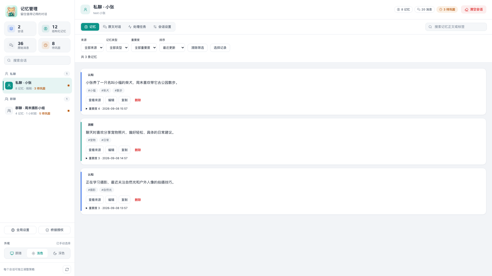
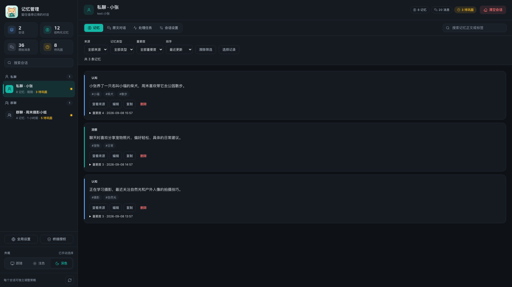

<div align="center">


# Memoir · 让对话留下记忆

为 AstrBot 保存对话、整理长期记忆，并在后续交流中按线索召回。

[](https://github.com/lxfight/astrbot_plugin_memoir/actions/workflows/ci.yml)
[](https://github.com/AstrBotDevs/AstrBot)
[](LICENSE)

**私聊与群聊 · 图片与语音 · 多层转发 · 可视化管理**

[使用指南](docs/guide.md) · [转发支持范围](docs/forwarding.md) · [更新日志](CHANGELOG.md)

</div>

## 主要能力

- **长期记忆**：保存原文，后台批量提炼认知与洞察，结合常驻、线索和群聊近因召回。
- **多媒体**：所选模型支持时描述图片、识别文字、转写音频；视频和普通文件保留占位符。
- **多层转发**：递归展开可用正文，长内容分块检索，记录节点来源；引用资料不写入个人画像或跨会话桥接。
- **记忆管理**：搜索筛选、编辑与批量删除；原文采用聊天气泡和向上滚动加载，支持展开转发、任务重试及明暗主题。

使用本地 SQLite，无需向量数据库或 Embedding 服务。原文有保留期和容量限制，长期记忆会随时间衰减。

## 快速上手

1. 在 AstrBot 插件管理中通过仓库链接安装：

   ```text
   https://github.com/lxfight/astrbot_plugin_memoir
   ```

2. 确认私聊、群聊记忆开关，选择「后台小模型」；留空时使用消息所属会话的当前模型。
3. 需要图片或语音识别时，在 AstrBot 提供商中勾选模型实际支持的「图像」或「音频」能力。
4. 聊天后发送 `/memoir` 查看统计，或从插件详情打开「记忆管理」。

> [!IMPORTANT]
> **私聊与群聊记忆默认开启。**群聊即使没有 @机器人或触发回复也可能记录；原文保存在本地，巩固会将原文和相关记忆发送给所选模型，受支持媒体也会交给模型解析。不需要的会话请关闭记忆；**关闭不会清除历史数据**，删除请使用「清空会话」。全局关闭优先于会话配置。
>
> 文本保存不调用模型；后台巩固、媒体解析及重试会产生调用费用，召回内容也会增加对话输入 Token。数量阈值并非费用上限，详见[调用与费用](docs/guide.md#模型调用与费用)。

原文先保存，记忆稍后提炼：默认每 30 分钟扫描，私聊积累 20 轮、群聊 50 条，或距上次巩固达到 12 小时后处理。原文默认保留 14 天，每会话最多 500 个原始事件。

## 多层转发

| 平台 / 输入 | 支持范围 |
| --- | --- |
| 通用 Node / Nodes | 递归展开内嵌消息 |
| OneBot / NapCat | 拉取转发 ID，继续展开嵌套引用 |
| Satori | 读取原始消息中的内嵌转发结构 |
| Telegram / Discord | 使用已交付正文、来源信息或消息快照 |
| 卡片、飞书等未提供正文的引用 | 保留可见预览，明确标注缺失部分 |

转发在后台处理，服务于**后续记忆与召回**，不保证当前回复立即理解全文。包含转发的整条入站消息（含附言）按引用处理；需保存自己的事实时，请单独发送普通消息。平台限制、处理预算与恢复方法见[多层转发说明](docs/forwarding.md)。

## 界面预览

<table>
  <tr><th>浅色</th><th>深色</th></tr>
  <tr>
    <td></td>
    <td></td>
  </tr>
</table>

*截图使用虚构演示数据。主题偏好保存在当前浏览器，支持窄屏与键盘操作。*

## 配置与文档

会话策略在「记忆管理 → 会话设置」中调整：记忆开关、召回预算、巩固阈值和桥接策略。未设置的会话选项继承全局配置；全局设置和桥接授权位于侧栏独立入口。

- [使用指南](docs/guide.md)：配置、媒体限制、记忆机制、费用与常见问题。
- [完整配置](_conf_schema.json)：全部字段及默认值。
- [开发与发布](docs/development.md)：测试、依赖与从 CHANGELOG 自动生成 Release。
- [更新日志](CHANGELOG.md)：已发布版本及主分支未发布变化。

跨会话桥接默认关闭，且需要用户通过 `/memoir consent on` 授权；`/memoir consent off` 撤销后续桥接。转发引用不参与桥接。

本文对应 `main` 分支。升级后重载插件，数据库自动迁移；多媒体和转发解析仅处理新消息。

[MIT License](LICENSE) · [问题反馈](https://github.com/lxfight/astrbot_plugin_memoir/issues) · [原创图标 SVG](docs/assets/logo.svg)
