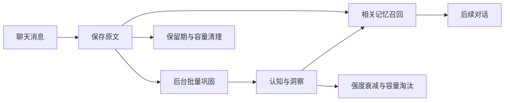

# 使用指南

[返回 README](../README.md) · [多层转发](forwarding.md)

### 模型调用与费用

| 环节 | 调用行为 |
| :--- | :--- |
| 文本保存 | 不额外调用模型。 |
| 记忆巩固 | 每批通常调用 1 次；输出格式或结构校验失败时最多重试 1 次。积压时单会话每轮扫描最多连续处理 3 批，因此单会话一轮最多可发起 6 次巩固请求。 |
| 图片与语音解析 | 按实际提供商合并附件：使用同一提供商时 1 次，分别选择图片与音频模型时最多 2 次；WebUI 手动重试会再次发起处理。 |
| 后续对话召回 | 检索本身不额外调用模型，但注入的记忆会增加对话模型的输入 Token，可能增加费用。 |

上述次数指插件发起的请求，不包含提供商内部可能发生的重试；实际费用以提供商计费为准。数量阈值控制巩固何时触发，不是调用次数或费用上限。多个会话的巩固与媒体请求会累加；需要控制开销时，可关闭不需要的会话记忆、选择合适的后台模型，并调整巩固阈值与召回字符预算。

## Token 用量统计

在 WebUI 侧栏打开「用量统计」，查看最近 7／30／90／365 天的趋势、提供商与任务汇总，以及每次调用的会话、模型、token、耗时和状态。支持按会话、提供商、任务筛选；趋势柱支持点击、悬停和键盘聚焦，明细每次读取最多 50 条。手机端可横向滑动图表和明细表。

统计使用 AstrBot 标准 `TokenUsage` 字段：**总 token = 未缓存输入（`input_other`）+ 缓存输入（`input_cached`）+ 输出（`output`）**。输入总量是前两项之和，缓存不重复累加。数字按模型返回值记录，不以文字长度估算；提供商没有返回完整 usage 时显示「未知」，与实际返回 0 区分。筛选时间按请求开始时间计算，日期按浏览器当前时区偏移分组。

仅统计升级后插件主动发起的巩固与图片／音频请求，包括自动和手动重试、原生和转发媒体。提供商内部重试无法单独观测；主聊天回复及召回注入带来的 token 不计入本页。混合媒体请求只记录整体用量，无法准确拆分图片和音频。失败、取消或进程中断也可能已产生费用，但未返回 usage 时无法计数，因此已报告总量不等于完整账单，不提供价格估算。

调用完成只表示拿到了模型响应；输出格式不合格、会话关闭或清空导致结果丢弃时，实际调用仍然计入。用量记录随插件数据库持久保存，不含提示词、回复正文、媒体路径或密钥；包含会话标识和模型标识。删除原文或清空会话不删除这份用量账目，避免丢失已发生的消耗。历史调用没有记录，不能追补。

## 记忆如何工作

### 捕获与巩固

私聊保存「用户＋助手」轮次；群聊保存被动收到的消息和机器人回复。忽略名单、关键词与会话开关会过滤群聊捕获。

巩固前先检索本批原文相关的旧记忆，供模型执行新增、更新、过期删除或忽略，并提炼洞察。去重范围包含会话、人物、记忆类型和 `memory_key`。同名群成员不会仅因昵称相同而合并；旧数据保留历史身份标签。

抽取会将相对时间归一化为日期，并通过标签补充同义表达。洞察也参与后续更新与删除。模型输出须通过完整结构校验，才会与原文处理状态一起原子写入；失败批次进入隔离状态，可从 WebUI 查看和重试。

转发消息会独立展开并按引用资料巩固，不写入个人画像或桥接。具体平台范围、限制和来源标记见[多层转发](forwarding.md)。

### 三层召回

| 层级 | 召回内容 |
| :--- | :--- |
| **常驻层** | 重要度与强度较高的语义记忆、洞察，形成稳定认知。 |
| **线索层** | 根据当前消息与最近上下文，检索相关记忆和原文；短语、标签与人物匹配获得更高分数。 |
| **近因层** | 仅群聊注入最近几条原文，补充群聊上下文。 |

三层共享 `recall_max_chars` 字符预算，默认 6000；仅强化实际注入提示词的记忆。私聊尽量排除模型当前上下文里已有的原文，减少重复。

### 遗忘与清理

原文默认保留 14 天，同时每个会话最多保留最近 500 个原始事件（转发分块随父事件清理）；高频会话的实际原文窗口可能短于 14 天。`raw_retention_days = 0` 只关闭按时间清理，容量限制仍然有效。

语义记忆与洞察按距上次激活的自然日数衰减，衰减本身不删除数据。事件型记忆过期后使用事件日期加宽限期作为衰减锚点，避免仅靠反复召回长期保留时效性事实。每个会话的结构化记忆上限为 200 条，超额时淘汰优先级较低的记录。

清空会话会删除记忆、原文和关联处理任务，并使正在处理的旧结果失效，防止清空后重新写回。来源原文被删除或过期时，来源面板会明确提示。

## 多媒体消息

| 消息类型 | 当前支持 |
| :--- | :--- |
| 文本 | 直接保存，不调用媒体模型。 |
| 图片、图文混合 | 模型声明支持图像时，生成图片描述与文字识别结果。 |
| 语音、音频混合 | 模型声明支持音频时，生成转写与必要描述。 |
| 视频、普通文件 | 保留类型占位符，暂不解析内容。 |
| 助手生成的媒体 | 暂不解析。 |

在 AstrBot 插件配置或 WebUI「全局设置」中分别选择「图片处理模型」与「音频处理模型」。优先使用对应模型；留空继承「后台小模型」，再回退当前会话模型。两项均选择 AstrBot 的聊天提供商，分别需要声明 `image`、`audio` 输入能力；音频项不是独立 STT 提供商接口。视频暂不接入模型。

同一条消息按实际提供商合并受支持附件；图片与音频使用不同提供商时分别调用，一个失败仍继续处理另一个。显式指定的模型不存在或不支持对应输入时保留占位符，不会偷偷换成其他模型。文本先保存，后台队列再补充描述，保留原消息时间；不会阻塞私聊回复钩子或触发群聊回复。该选择同样适用于转发内的图片和音频。

<strong>处理限制、失败恢复与媒体引用</strong>

| 项目 | 限制 |
| :--- | :--- |
| 待处理与处理中任务 | 普通媒体与转发共 32 条，固定 2 个工作者 |
| 单条附件 | 最多 4 个 |
| 解析后文件大小 | 单个 10 MiB、合计 20 MiB |
| 输入引用总量 | 4 MiB，包含 Base64 |
| 超时 | 单个附件解析 10 秒、每个模型请求 30 秒、媒体阶段合计 110 秒 |
| 保存文字 | 每个模型描述最多 800 字、合计最多 1600 字；有描述时用户文本最多 1000 字；完整轮次仍受 2000 字上限约束 |

单个附件损坏时继续处理其他附件。超额、模型报错、超时或空结果会保留原文与占位符，并记录失败；部分解析成功时也可重试。原文过期后无法重试，临时文件或链接失效时需要重新发送。

为了支持重启恢复与重试，操作队列会暂存本地路径、URL 或受限 Base64 引用。引用不进入记忆检索或模型召回；成功后立即清除，原文删除或过期后清理关联媒体任务，失败诊断最多保留 30 天。

排队和处理中原文暂不参与巩固。解析结果命中群聊忽略关键词时，会删除原文和任务；此时媒体已经发送给模型识别。模型描述带有 `[多媒体解析]` 标记，不等同于用户原话。

仅处理启用后的新消息；历史占位符没有媒体源，无法补充识别。

## 配置指南

大多数情况下，先使用默认值，再根据会话数量、模型费用与召回效果调整即可。

| 常用全局配置 | 默认值 | 用途 |
| :--- | :--- | :--- |
| `background_llm_provider` | 留空 | 使用会话当前模型；也可指定后台模型。 |
| `image_llm_provider` | 留空 | 图片模型；继承后台模型，再回退当前会话模型。 |
| `audio_llm_provider` | 留空 | 支持音频输入的聊天模型；回退顺序同上。 |
| `recall_max_chars` | `6000` | 三层召回总字符预算，可设为 512–20000。 |
| `recall_core_top_k` / `recall_top_k` / `recall_recent_turns` | `3` / `5` / `5` | 常驻、线索、群聊近因层条数。 |
| `consolidation_scan_interval_minutes` | `30` | 后台扫描间隔。 |
| `consolidation_count_threshold_private` / `consolidation_count_threshold_group` | `20` / `50` | 私聊、群聊积累数量阈值。 |
| `consolidation_idle_hours` | `12` | 距上次巩固的时间阈值，未巩固过则从会话创建时计算。 |
| `consolidation_related_top_k` | `20` | 巩固时提供给模型的相关旧记忆条数。 |
| `raw_retention_days` | `14` | 原文保留天数；0 只关闭按时间删除。 |
| `enable_cross_scope_bridge` | `false` | 是否允许已授权的群聊自我陈述进入私聊流程。 |

完整配置与字段说明见 [`_conf_schema.json`](../_conf_schema.json)。

### WebUI 操作

原文对话预览：[浅色](assets/webui-raw-light.png) · [深色](assets/webui-raw-dark.png)（1920×1080）。

- **记忆**：按正文/标签搜索，按来源、类型和重要度筛选；搜索结果支持分页。可修改正文、标签及重要度，保留来源和归属并标记人工修订。后台仍可能在后续巩固中更新记忆；编辑期间内容已变化时会拒绝覆盖，需刷新后重新编辑。
- **原文对话**：采用 Telegram 风格聊天流，打开时显示最新 40 个原始事件并定位到底部，向上滚动加载历史；加载失败可点击顶部重试。用户与助手左右分列，群聊显示发言人。点击气泡内「⋯」查看完整消息、复制或删除原始记录；私聊删除整轮对话。点击转发气泡可查看全部现存分块、折叠层级、复制全文或删除单个分块。
- **搜索与选择**：原文搜索包含转发分块，可按发送者、日期、来源和处理状态筛选，筛选结果同样滚动加载。批量选择仅针对已加载的原始事件，单次最多 100 条；继续加载历史不会自动勾选新加载的记录。记忆管理仍使用分页。切换筛选或刷新会重新加载最新匹配消息；新到消息通过刷新获取。

- **批量删除**：点击「选择记录」后选择记忆当前页或已加载的原文记录，确认范围再删除。删除记忆不会删除原文；删除转发事件会连同分块和解析任务删除，已提炼记忆保留。清空会话才会一并清除。
- **处理任务**：查看最近 100 条任务、中文处理建议和原始错误，可恢复任务可重试。页面可见且有活动任务时每 5 秒刷新；离开页面或切换后台时停止，操作任务按钮时暂缓自动刷新。
- **设置**：会话页展示当前生效值及全局/会话来源；全局总开关优先。修改后显示未保存状态，切换页面或刷新前提醒。保存失败保留输入。
- **手机端**：顶部按钮打开会话抽屉；选择会话后收起，正文不再排在完整侧栏下面。浅色、深色及跟随主题保持可用。

原文使用「时间＋ID」游标和会话索引查询，不执行深页 OFFSET 或每批总数统计；页面显示已加载数量。虚拟列表只渲染可视区域附近的消息（最多 60 个事件），支持可变高度、展开状态与阅读位置保持。转发节点正文按需读取。已加载的文本仍会保存在当前页面内存中，切换页面／会话或刷新时释放；全词包含搜索仍需扫描匹配候选，不等同于全文索引搜索。

搜索、查看和人工编辑不额外调用模型；重试处理可能再次调用模型。

### 会话独立策略

WebUI 的「会话设置」只存差异值，未填写项继承全局默认。可覆盖：

| 配置项 | 作用 |
| :--- | :--- |
| `enabled` | 本会话记忆开关，与全局类型开关叠加。 |
| `recall_max_chars` | 本会话召回总字符预算。 |
| `recall_core_top_k` / `recall_top_k` / `recall_recent_turns` | 召回条数。 |
| `consolidation_count_threshold` / `consolidation_idle_hours` | 巩固触发条件。 |
| `bridge_enabled` / `bridge_max_sensitivity` | 桥接开关与敏感度上限。 |

关闭全局类型记忆或会话记忆，会阻止捕获、巩固和相关桥接写入。桥接还检查目标私聊的开关和用户授权。

### 聊天指令

| 指令 | 作用 |
| :--- | :--- |
| `/memoir` | 查看当前会话记忆统计。 |
| `/memoir consent` | 查看自己的群聊桥接授权状态。 |
| `/memoir consent on` | 授权将群聊中的自我陈述送入自己的私聊记忆流程。 |
| `/memoir consent off` | 关闭授权，阻止后续桥接。 |

桥接需要同时满足全局开关、会话开关、用户授权与敏感度上限；授权本身不会绕过其他限制。

## 常见问题

<strong>原文有了，为什么还没有长期记忆？</strong>

原文捕获和长期记忆抽取分开进行。先检查扫描间隔、数量阈值与时间阈值，再到「处理任务」查看失败原因。模型明确返回空的 `semantic_ops` 数组，也可能表示本批没有值得长期保存的事实。

<strong>为什么图片或语音只有占位符？</strong>

确认所选模型实际支持对应媒体，并在 AstrBot 中配置了模型能力；然后检查处理状态。文件失效、大小超限或模型请求失败时，插件会保留占位符。旧消息未保存媒体源，无法追补。

<strong>升级后提示会话模型不可用怎么办？</strong>

后台模型留空时，周期巩固使用捕获时保存的 AstrBot 会话标识选择当前模型。旧会话可能缺少该标识：指定后台模型，或在该会话产生新消息后，到 WebUI 重试失败任务。

